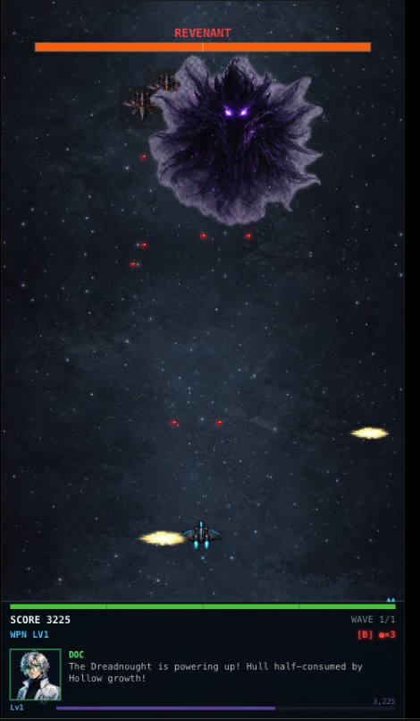

# Sector Zero

A vertical space shooter set at the edge of human survival.



## Play Now

**[colorpulse6.github.io/sector-zero](https://colorpulse6.github.io/sector-zero/)**

## About

Sector Zero is a browser-based vertical space shooter set in the year 2847. Humanity is on the brink — the Hollow, a machine intelligence born from humanity's own technology, has pushed civilization to its last stronghold. You pilot the Harbinger, a cutting-edge fighter tasked with dismantling the Hollow across six combat modes. With RPG progression, multi-phase boss fights, and a story that unfolds mission by mission, Sector Zero is more than a shooter.

## Features

- **Vertical Shooter** — Classic top-down space combat with modern polish
- **Ship Boarding** — Close-quarters combat aboard enemy vessels
- **Ground Run & Gun** — Side-scrolling combat on hostile terrain
- **First-Person Raycaster** — Retro-style interior infiltration
- **Multi-Phase Boss Fights** — Scripted encounters with distinct phases
- **Cockpit Mode** — Strategic turret defense from the ship's bridge
- **RPG Systems** — XP, level-ups, weapons, crew, and codex progression
- **Colony System** *(coming soon)* — Build and manage a base between missions

## Quick Start

```bash
git clone https://github.com/colorpulse6/sector-zero.git
cd sector-zero/game && yarn install && yarn dev
```

Open [http://localhost:3000](http://localhost:3000) to play locally.

## Companion Site

Mission logs, dev updates, and lore at:
**[colorpulse6.github.io/sector-zero/site](https://colorpulse6.github.io/sector-zero/site/)**

## Built With

- [Next.js 15](https://nextjs.org/) — App framework and static export
- HTML5 Canvas — Game rendering at 480x854
- TypeScript — Strict-mode throughout
- Tailwind CSS — UI and HUD styling
- React 19 — Component architecture

## Contributing

See [CONTRIBUTING.md](CONTRIBUTING.md) for how to get involved.

## License

[MIT](LICENSE) — Copyright (c) 2026 Nichalas Barnes
