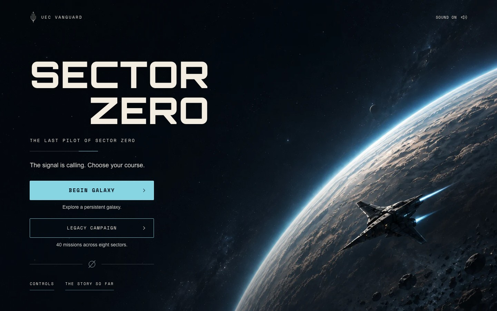
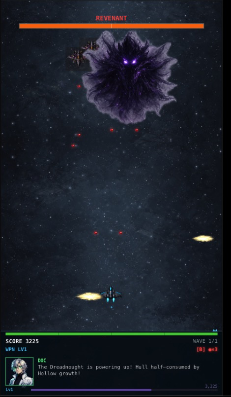
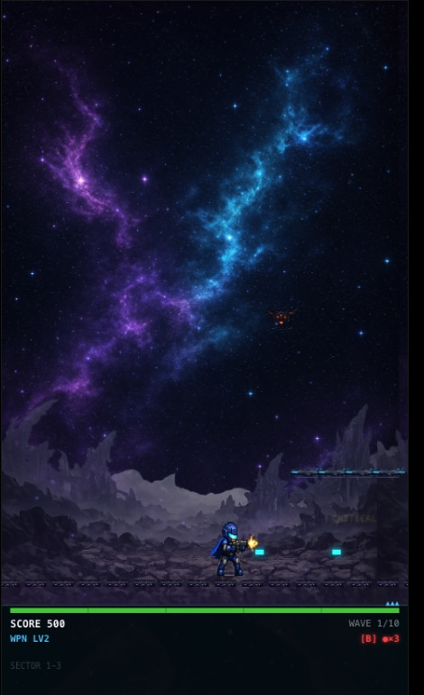
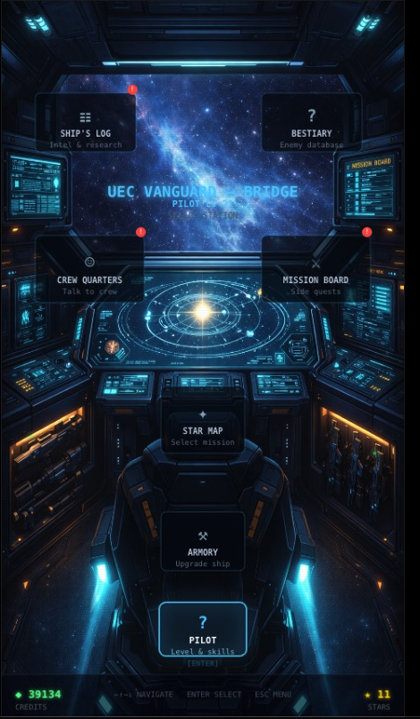

# Sector Zero

**Answer the signal. Explore the frontier. Face the Hollow.**

[](https://colorpulse6.github.io/sector-zero/)

<p align="center">
  <a href="https://colorpulse6.github.io/sector-zero/"><strong>Play in your browser</strong></a>
  &nbsp; · &nbsp;
  <a href="https://colorpulse6.github.io/sector-zero/site/">Explore the website</a>
  &nbsp; · &nbsp;
  <a href="https://colorpulse6.github.io/sector-zero/site/news/">Read the mission logs</a>
</p>

A browser-based space adventure set in 2847. Fight through hostile sectors, board enemy ships, and step into the settlements holding the frontier together. Return to the **UEC Vanguard** to prepare for whatever comes next.

Choose **Begin Galaxy** to explore a persistent galaxy, or **Legacy Campaign** for 40 missions across eight sectors.

## From the game

<table>
  <tr>
    <td width="33%" align="center"><strong>Space combat</strong></td>
    <td width="33%" align="center"><strong>Ground assault</strong></td>
    <td width="33%" align="center"><strong>The Vanguard</strong></td>
  </tr>
  <tr>
    <td><a href="site/public/images/modes/boss-fight.png"></a></td>
    <td><a href="site/public/images/modes/ground.png"></a></td>
    <td><a href="site/public/images/modes/cockpit.png"></a></td>
  </tr>
</table>

*In-game captures. Select an image to view it at full size. The opening screen above uses illustrative key art.*

## Six ways to fight

- **Space combat** — Weave through enemy formations and take on the bosses guarding eight sectors.
- **Ship boarding** — Breach enemy vessels and fight through tight corridors.
- **Ground assault** — Run, jump, and shoot across hostile terrain.
- **First-person combat** — Explore interiors and face the threats around the next corner.
- **Turret defense** — Track incoming fighters from the gunner's seat.
- **Multi-phase missions** — Move between combat modes as a mission unfolds.

## A world between missions

- **Colonies and buildings** — Found outposts, commission buildings, manage resources, and explore settlements in first person.
- **NPCs and trading** — Talk to colonists, buy supplies from the quartermaster, and visit the cantina for drinks and rumors.
- **Pilot progression** — Earn XP, develop your skills, upgrade your loadout, and build out your codex.
- **Keyboard and touch** — Use mode-specific controls on desktop or on-screen controls on mobile.
- **Saved progress** — Continue your journey with saves stored locally in your browser.

See the [colony overview](https://colorpulse6.github.io/sector-zero/site/coming-soon/) for what's playable now and what's planned next.

## Run locally

Use **Node.js 20** and enable Corepack for the project's Yarn version.

```bash
git clone https://github.com/colorpulse6/sector-zero.git
cd sector-zero
corepack enable
cd game
yarn install
yarn dev
```

Open [localhost:3000](http://localhost:3000) to play.

To run the companion site, open another terminal from the repo root:

```bash
cd site
yarn install
yarn dev --port 3001
```

Open [localhost:3001](http://localhost:3001) for the website.

## Built with

**Next.js 15 · React 19 · TypeScript · HTML5 Canvas · Tailwind CSS**

The game renders on a 480 × 854 canvas. The game and companion site are independent Next.js apps, exported as static files and deployed together to GitHub Pages.

## Contributing

See [CONTRIBUTING.md](CONTRIBUTING.md) for setup, contribution guidelines, and the pull request process.

## License

[MIT](LICENSE) — Copyright (c) 2026 Nichalas Barnes
