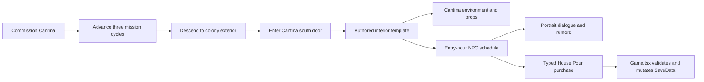
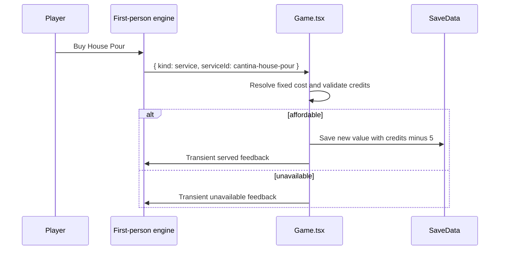

# Sector Zero — M3 Cantina Runtime Integration Design

**Date:** 2026-07-20
**Status:** Approved design; implementation not started
**Milestone:** M3 — Living Settlements
**Scope:** One Cantina-first vertical slice that integrates the production-reviewed
Cantina art bundle into normal colony exploration without implementing general colony
tier promotion, district growth, bulletin-board quests, or Atlas-to-colony travel.

---

## Outcome

The Cantina becomes the first fully authored colony hub interior. A player can commission
it through the existing colony menu, wait for construction, descend to the colony, enter
the facade through its real exterior door, see the reviewed Cantina wall/floor/ceiling and
props, meet three scheduled NPC roles with portraits, buy a drink, and hear deterministic
rumors. The same path is available through a dedicated DevPanel fixture for repeatable
playtesting.

The slice extends the current interior-template seam rather than creating a second hub
runtime. Existing Phase-1 stub interiors and Ashfall shops keep their present behavior when
the new optional data is absent.



## Decisions

### 1. Extend `InteriorTemplate`; do not add a parallel hub registry

`InteriorTemplate` gains two additive, optional fields:

```typescript
interface InteriorEnvironmentArt {
  wallSpriteId: string;
  floorSpriteId: string;
  ceilingSpriteId?: string;
  skySpriteId?: string;
}

interface InteriorNpcSchedulePeriod {
  startHour: number;
  anchor: { x: number; y: number } | null;
}

type InteriorNpcContentId =
  | "hub-bartender"
  | "hub-regular"
  | "hub-signal-chaser";

interface InteriorNpcSlot {
  contentId: InteriorNpcContentId;
  schedule: readonly [InteriorNpcSchedulePeriod, InteriorNpcSchedulePeriod];
}

interface InteriorNpcContext {
  seed: number;
  periodIndex: 0 | 1;
}

interface InteriorNpcDefinition {
  roleId: string;
  name: string;
  type: "quest" | "merchant" | "lore";
  spriteId: string;
  portraitKey: string;
  color: string;
  buildDialog: (context: InteriorNpcContext) => FPDialogLine[];
  buildShopItems?: (context: InteriorNpcContext) => FPShopItem[];
  canBuy?: boolean;
}

interface InteriorTemplate {
  // Existing fields remain unchanged.
  environmentArt?: InteriorEnvironmentArt;
  npcSlots?: InteriorNpcSlot[];
}
```

The template owns placement and schedule data. A separate, exhaustive
`INTERIOR_NPC_DEFINITIONS` record owns the concrete content for each
`InteriorNpcContentId`: identity, presentation, dialog builder, optional shop builder, and
`canBuy`. The record contains only the three Cantina roles in this slice. This separation
keeps `generateInteriorState` generic while ensuring it can construct every required
`FPNPC` field without a Cantina branch or an untyped interaction lookup. Marketplace and
Town Hall can add content IDs later, but this slice does not invent their layouts, roles,
or interactions.

`generateInteriorState` receives the entry hour explicitly. It resolves each slot to a
period and anchor once, looks up the slot's exhaustive content definition, calls its dialog
and shop builders with `{ seed, periodIndex }`, builds the `FPNPC[]`, and leaves that
placement fixed until the player exits. No interior movement sidecar or live clock is
introduced.

If `environmentArt` is absent, generation preserves the current Ashfall sky, interior wall,
metal floor, and no-ceiling fallback. If it is present, the template owns the complete set:
the Cantina supplies wall, floor, and ceiling but deliberately supplies no sky. This makes
the existing perspective ceiling path active without adding renderer branching.

### 2. Hand-authored Cantina layout

The exterior footprint is 4×4 with a south-facing door, so it fits all six existing
Outpost slots and matches the current exit-reposition rule. The interior is a 12×10 room
with one south exit and spawn on that exit facing north.

```text
############
#.B..#.....#
#....#.....#
#...C......#
#..........#
#..T....R..#
#..........#
#..........#
#..........#
#####D######
```

- `B`: bottle rack at `(2, 1)`
- `C`: bar counter at `(4, 3)`
- `T`: table cluster at `(3, 5)`
- `R`: rumor terminal at `(8, 5)`
- `D`: exit and player spawn at `(5, 9)`

The partial wall at `x=5` creates a service alcove without closing the room. The main aisle
from the door stays clear. Props remain visual billboards, not collision objects; they are
placed against walls or outside the required route. General prop collision is deferred.

### 3. Register the Cantina production bundle only

The following manifest-defined constants are registered in `SPRITES` and consumed by the
Cantina template:

- Environment: `HUB_CANTINA_WALL`, `HUB_CANTINA_FLOOR`,
  `HUB_CANTINA_CEILING`, `COLONY_WALL_CANTINA`
- Props: `HUB_CANTINA_PROP_BAR_COUNTER`, `HUB_CANTINA_PROP_BOTTLE_RACK`,
  `HUB_CANTINA_PROP_TABLE_CLUSTER`, `HUB_CANTINA_PROP_RUMOR_TERMINAL`
- Billboards: `NPC_HUB_BARTENDER`, `NPC_HUB_REGULAR`,
  `NPC_HUB_SIGNAL_CHASER`
- Portraits: `PORTRAIT_HUB_BARTENDER`, `PORTRAIT_HUB_REGULAR`,
  `PORTRAIT_HUB_SIGNAL_CHASER`

These remain single-frame sprites and do not enter `SHEETS` or `MAT_ALLOWLIST`.
Marketplace and Town Hall assets remain present but unregistered and unconsumed.

The four props stay on the current square billboard plane with `widthFactor: 1`. Their
reviewed 256×256 transparent canvases preserve each visible subject's natural proportions
through alpha padding. Per-slot `scale` controls apparent size; the runtime integration does
not stretch the subject or introduce a speculative non-square plane contract. Actual-size
480×854 inspection is the acceptance gate.

### 4. Deterministic two-period NPC schedules

Schedule periods use an inclusive start hour and continue until the next period begins,
including the midnight wrap. Resolution uses `save.gameClock.hour` at interior entry and is
stable for the entire visit.

| Role | 06:00–18:00 | 18:00–06:00 |
|---|---|---|
| Bartender | Behind counter `(3, 2)` | Service alcove `(3, 1)` |
| Regular | Table side `(4, 6)` | Bar seat `(6, 4)` |
| Signal-chaser | Rumor terminal `(9, 5)` | Absent |

Role IDs are stable content identities; visible labels remain `BARTENDER`, `REGULAR`, and
`SIGNAL CHASER`. No saved global NPC records, assigned-NPC mutations, pathfinding, or
interior schedule ticking are added.

### 5. Portrait dialogue is a generic renderer capability

`FPDialogLine.portraitKey` remains a `SPRITES` constant key. The first-person dialog renderer
resolves that key the same way the existing dashboard and cockpit renderers do, draws the
portrait in a fixed square at the left of the 140-pixel dialog panel, and gives the remaining
width to speaker and wrapped text.

If the line has no key, the key is unknown, or the image is not loaded, the renderer keeps
the current full-width speaker/text layout. Shop panels remain unchanged and do not show a
portrait. The change is generic; there is no Cantina conditional in the renderer.

A small exported pure helper resolves an optional constant key to a registered portrait
path and computes the portrait/text rectangles. The canvas renderer then calls `getSprite`
for that path and uses the portrait layout only when an image is available. Unit tests cover
present, absent, and unknown keys plus both layout shapes; the production-export playtest
proves the reviewed file actually loads and draws.

### 6. Drinking and rumors use explicit ownership

The bartender is a buyable merchant with one service row:

- **House Pour** — 5 player credits
- Flavor-only in this slice: no inventory item, status effect, buff, achievement, or saved
  consumption history

The service path is typed end to end:

```typescript
type FPServiceId = "cantina-house-pour";

interface FPShopItemBase {
  id: string;
  name: string;
  description: string;
  cost: number;
}

type FPShopItem =
  | (FPShopItemBase & {
      type: "consumable" | "material" | "upgrade";
      itemId?: string;
      serviceId?: never;
    })
  | (FPShopItemBase & {
      type: "service";
      serviceId: FPServiceId;
      itemId?: never;
    });

type FPShopPurchaseRequest =
  | { kind: "consumable"; itemId: ConsumableId }
  | { kind: "service"; serviceId: FPServiceId };
```

A `CANTINA_SERVICE_DEFS` record is the single source for the House Pour name, description,
and 5-credit cost. The bartender shop builder and `applyShopPurchase` both read that record,
so displayed and charged prices cannot diverge. The engine may emit only the service ID; it
does not send an authoritative price. `applyShopPurchase` returns a new `SaveData` only when
the fixed service is known and affordable. `Game.tsx` remains the sole exploration-time
owner of applying and saving the player-wallet mutation.

The existing `FPDialogState.shopFlashFrames` countdown is generalized with two additive
fields:

```typescript
shopFlashText?: string;
shopFlashTone?: "success" | "error";
```

On a successful service application, `Game.tsx` sets `HOUSE POUR SERVED`, `success`, and 90
frames. On failure it sets `PURCHASE UNAVAILABLE`, `error`, and 90 frames. The engine's
existing frame tick expires the message. The renderer uses green for success and the
current red for error; absent text/tone preserve the existing unavailable presentation.
The feedback is transient and not persisted. Successful consumable purchases keep their
current no-message behavior. Ashfall's display-only merchant and the quartermaster's
faction-adjusted consumable flow remain unchanged.

The regular and signal-chaser each receive deterministic rumor dialogue selected from a
small authored Cantina pool using the interior seed, role ID, and resolved entry period.
Identical inputs yield identical lines. Hearing a rumor changes no save field, and the pool
does not imply a quest or operation.



### 7. Bulletin-board and Atlas boundaries

The rumor terminal is a visible, non-interactive prop in this slice. Bulletin-board v1 is a
future Game-owned overlay opened through a typed engine request. This integration does not
activate `Quest.source: "board"`, implement cycle step 8, rotate/persist offers, accept
quests, or add operations to `operationCatalog`.

The parent Phase-3 catalog also describes faction-aware dialog and rotating strangers with
quests. This vertical slice deliberately delivers a fixed signal-chaser role and
deterministic flavor rumors only. Faction branches, stranger rotation, and quest-bearing
visitors remain a named follow-up after bulletin-board and quest ownership are designed.
Consequently this PR may claim **Cantina runtime vertical slice integrated**, but not
**complete Tier-4 Cantina catalog** or **Phase 3 complete**.

Atlas and Region systems are unchanged. Normal access means the existing legacy path:

```text
Cockpit → Colonies → Colony Detail → Descend → Exterior → Cantina Door
```

Canonical Galaxy/Atlas-to-colony descent remains a separate follow-up. The Cantina does not
add a Galaxy projection field, route, contact, operation, or escape hatch.

### 8. Commissioning and DevPanel access

Cantina is added directly to the current commission menu:

- Cost: 200 colony metal
- Construction: 3 mission cycles
- Power demand: the existing catalog value of 2
- Description: social hub for drinks and rumors

This direct entry is a scoped M3 unlock exception. It does not add or pretend to implement
the colony's deferred tier-promotion rules. The build still uses the existing reducer,
resource check, slot cap, construction status, and cycle-completion flow.

A `SEED CANTINA` fixture uses hour 17:00 and places solar array, farm, water purifier,
habitat module, and Cantina in that order. Cantina is therefore within the six rendered
slots, the solar array covers the fixture's power demand, and all three Cantina roles are
present. The fixture enters the real exterior; the tester must walk to and enter the actual
door. No direct interior teleport is added.

### 9. Persistence and static export

No save migration is required:

- `BuildingType` already includes `cantina`.
- The commissioned building uses the existing persisted `ColonyBuilding` shape.
- The drink uses the existing player-credit field.
- Schedule positions, rumor selection, and feedback are derived or transient.
- `ColonyBuilding.interiorTemplateId` remains untouched because the current footprint
  registry remains the runtime authority.

All new constants, templates, schedules, and rumor pools are module-pure. Image construction
and loading stay in the existing client-side sprite loader. No `window`, `document`, canvas
context, clock, or network access is introduced at module scope, preserving static export.

## Error and fallback behavior

- A missing Cantina footprint/template is a programmer error and retains the generator's
  explicit throw behavior.
- Invalid or absent optional template art falls back only when the entire optional art
  contract is absent; registered Cantina paths are validated by sprite tests.
- An NPC schedule with an absent anchor omits that NPC from the generated `FPNPC[]`.
- An unknown portrait key or unloaded portrait uses the current text-only dialog layout.
- An unknown service ID or insufficient credits returns no new save and displays unavailable
  feedback; the request is cleared exactly once either way.

## Verification and acceptance

Implementation follows red-green TDD in small commits. Focused coverage must prove:

1. Every Cantina asset constant matches the manifest path, the production files pass the
   existing sprite audit, and none enters `SHEETS` or `MAT_ALLOWLIST`. Browser playtesting,
   not `preloadAll`, is the proof that each image decodes and draws.
2. The 4×4 footprint fits every Outpost slot; the 12×10 template has one south door, a valid
   spawn, in-bounds props/anchors, Cantina art, and a filled Cantina floor texture map.
3. Schedule boundaries at 06:00 and 18:00 resolve deterministically, including signal-chaser
   absence and repeat-entry identity.
4. Portrait rendering uses the supplied key and falls back safely for absent/unknown art.
5. House Pour emits one typed request per accepted input, charges the fixed authoritative
   cost once, reports success, and leaves an unaffordable save unchanged.
6. Rumors are deterministic and do not mutate `SaveData`.
7. The DevPanel fixture keeps Cantina within the six visible slots at 17:00.
8. A normal commission → three cycles → operational exterior → door → interior → exit flow
   works through existing reducers and scene-stack transitions.
9. Existing Phase-1 interiors retain their shared Ashfall art and dimensions; Ashfall's
   display-only shop and the quartermaster's buyable consumable shop retain their behavior.
10. Operation catalog, Atlas projection, save migration, and cycle quest processing remain
    unchanged.

Final gates from `game/`:

```bash
npx tsc --noEmit
yarn colony:test
yarn engine:test
yarn sprites:test
yarn build
NEXT_PUBLIC_DEVTOOLS=1 yarn build
```

The DevTools production export must then be served and exercised at a real 480×854 viewport.
The playtest must capture `docs/assets/reviews/m3-hubs/cantina/gameplay-480x854.png` showing,
in one gameplay frame where practical, the Cantina environment, at least one prop, and at
least one NPC. Durable results live in `docs/playtests/2026-07-20-m3-cantina.md`, recording
the served screenshot, exact build/serve commands, viewport, ceiling, all four prop scales,
all three NPC identities, portrait legibility, drink success/failure, rumor repeatability,
door exit, and console status.

## Explicit non-goals

- Marketplace or Town Hall runtime integration
- General colony tiers, promotion, district growth, or political systems
- Bulletin-board UI, quest persistence, quest ticking, or operation acceptance
- Faction-aware Cantina branches or rotating quest-bearing strangers
- Atlas/Galaxy-to-colony descent
- Persistent named-NPC registry or interior NPC movement/pathfinding
- Drink inventory, buffs, drunkenness, or achievement tracking
- General prop collision or non-square billboard geometry
- New biome/faction hub variants, animation sheets, or runtime asset generation
